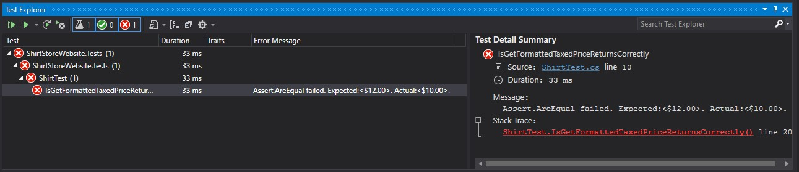
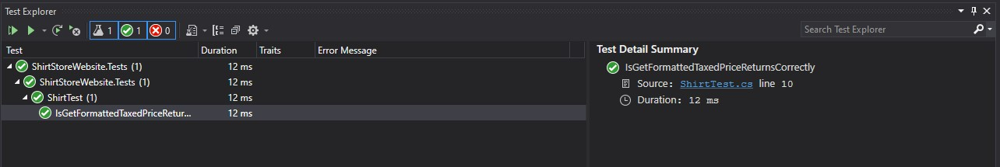

# Module 10: Testing and Troubleshooting

## Lab: Testing and Troubleshooting

1. **Nombres y apellidos:** Francisco Javier Moreno Quevedo
2. **Fecha:** 02/12/2020
3. **Resumen del Ejercicio:** Testear el metodo GetFormattedTaxedPrice de la clase  Shirt del modelo de la aplicacion
4. **Dificultad o problemas presentados y como se resolvieron:** Ninguna


- Ejercicio 1: Testing a Model
  - Añadimos un proyecto de test
  
  - Añadimos la carpeta Models
  
  - Añadimos la clase ShirtTest
  
  - Añadimos el metodo IsGetFormattedTaxedPriceReturnsCorrectly
  
    

```cs
    public void IsGetFormattedTaxedPriceReturnsCorrectly()
    {
        Shirt shirt = new Shirt
        {
            Price = 10F,
            Tax = 1.2F
        };

        string taxedPrice = shirt.GetFormattedTaxedPrice();

        Assert.AreEqual("$12.00", taxedPrice);
    }
```


- Ejecutamos el test



Vemos que falla porque esperaba el valor de 12 y devuelve 10

Vamos a la clase **shirt** al metodo GetFormattedTaxedPrice y cambiamos

```cs
    return Price.ToString($"C2", CultureInfo.GetCultureInfo("en-US"));
```

por

```cs
    return (Price * Tax).ToString($"C2", CultureInfo.GetCultureInfo("en-US"));
```


Volvemos a ejecutar los test y comprobamos que ahora funciona correctamente

